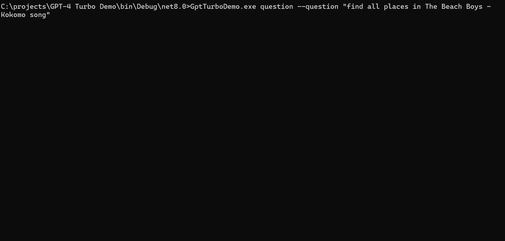

<!-- PROJECT LOGO -->
<br />
<div align="center">
  <a href="https://github.com/ml-cloud-playground/ml-cloud-playground">
    
  </a>

  <h3 align="center">GPT4 Turbo Demo</h3>

  <p align="center">
    A quick demo of JSON result return set from GPT Turbo.
  </p>
</div>


<!-- ABOUT THE PROJECT -->
## About The Project

<a href="https://github.com/ml-cloud-playground/ml-cloud-playground">
    
  </a>

I worked on the GPTTurbo model over the weekend and found it enjoyable and insightful. I created a demo using a C# console application with Spectre.Console for styling. The model can return structured data, such as a list of places mentioned in The Beach Boys’ “Kokomo” song, as serialized JSON objects. I also used a generic class called AiEntity to enable AI capabilities for objects with parameterless constructors. You can check out the complete code in the repo.


<p align="right">(<a href="#readme-top">back to top</a>)</p>


### Built With


<p align="right">(<a href="#readme-top">back to top</a>)</p>


<!-- GETTING STARTED -->
## Getting Started

### Prerequisites

- [OpenAI key](https://openai.com/)
- .NET 8.0

### Running the code

1. Clone the repo
   ```powershell
   git clone https://github.com/ml-cloud-playground/gpt4-turbo-demo.git
   ```

2. Add your OpenAI key to `appsettings.json`. This is meant to be a quick demo. There are better places, such as `localsettings.json`, environment variables, AWS Secrets Manager, Azure Key Vault, Hashicorp Vault, etc., to add secrets for better security.


3. Build the project with

  ```powershell
 dotnet build
  ```
4. Run the executable from the `bin` folder with
   
   ```powershell
   GptTurboDemo.exe question --question "find all places in The Beach Boys - Kokomo song"
   ```


<p align="right">(<a href="#readme-top">back to top</a>)</p>


<!-- LICENSE -->
## License

Distributed under the MIT License. See `LICENSE` for more information.

<p align="right">(<a href="#readme-top">back to top</a>)</p>